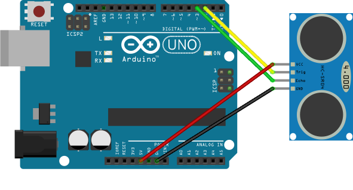

# HC-SR04 Ultrasonic Distance Sensor library for Arduino

[](https://travis-ci.org/Erriez/ErriezHCSR04)

This is a HC-SR04 I2C RTC library for Arduino.


## Library features

* Measure distance between 3cm .. 400cm or 1.18" .. 157.48"
* Accuracy around +/-1cm
* Optimized pin control for AVR


## Hardware

**Arduino UNO**

* TRIG pin to Arduino Uno pin 2
* ECHO pin to Arduino Uno pin 3
* VCC pin to Arduino Uno pin VCC
* GND pin to Arduino Uno pin GND




## Examples

Arduino IDE | Examples | Erriez HC-SR04:

* [HC-SR04 Centimeter](https://github.com/Erriez/ErriezHCSR04/blob/master/examples/ErriezHCSR04Centimeter/ErriezHCSR04Centimeter.ino)
* [HC-SR04 Inch](https://github.com/Erriez/ErriezHCSR04/blob/master/examples/ErriezHCSR04Inch/ErriezHCSR04Inch.ino)


## Documentation

* [Doxygen online HTML](https://erriez.github.io/ErriezHCSR04)
* [Doxygen PDF](https://github.com/Erriez/ErriezHCSR04/blob/master/ErriezHCSR04.pdf)
* [Datsheet](https://www.google.com/search?q=%22hc-sr04%20pdf%22)


## Example

```c++
#include <ErriezHCSR04.h>

// Pin defines
#define TRIG_PIN    2
#define ECHO_PIN    3

// Create sensor object
ErriezHCSR04 hcsr04(TRIG_PIN, ECHO_PIN);


void setup()
{
    // Initialize serial port
    delay(500);
    Serial.begin(115200);
    while (!Serial) {
        ;
    }
    Serial.println(F("\nErriez HC-SR04 ultrasonic distance sensor example\n"));

    // Initialize pins
    hcsr04.begin();
}

void loop()
{
    int16_t distance;

    // Measure distance in centimeter
    distance = hcsr04.getDistance();

    // Print distance
    Serial.print(F("Distance: "));
    if (distance >= 0) {
        Serial.print(distance);
        Serial.println(F(" cm"));
    } else {
        Serial.println(F("-"));
    }

    // Wait
    delay(250);
}
```

### Measure distance in Inches

```c++
void loop()
{
    float distance;

    // Measure distance in Inch
    distance = hcsr04.getDistanceInch();

    // Print distance
    Serial.print(F("Distance: "));
    if (distance >= 0) {
        Serial.print(distance);
        Serial.println(F("\""));
    } else {
        Serial.println(("-"));
    }

    // Wait
    delay(250);
}
```


## Library dependencies

* None


## Library installation

Please refer to the [Wiki](https://github.com/Erriez/ErriezArduinoLibraries/wiki) page.


## More Arduino Libraries from Erriez

* [Erriez Libraries](https://github.com/Erriez/ErriezArduinoLibraries)
